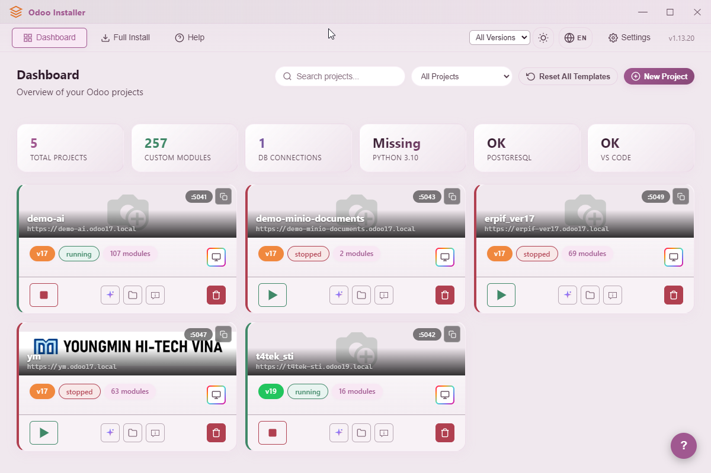
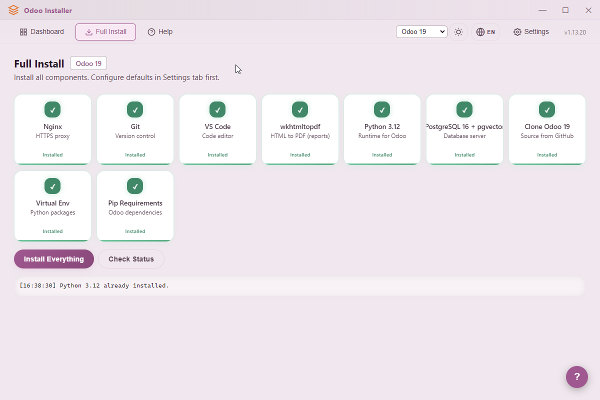
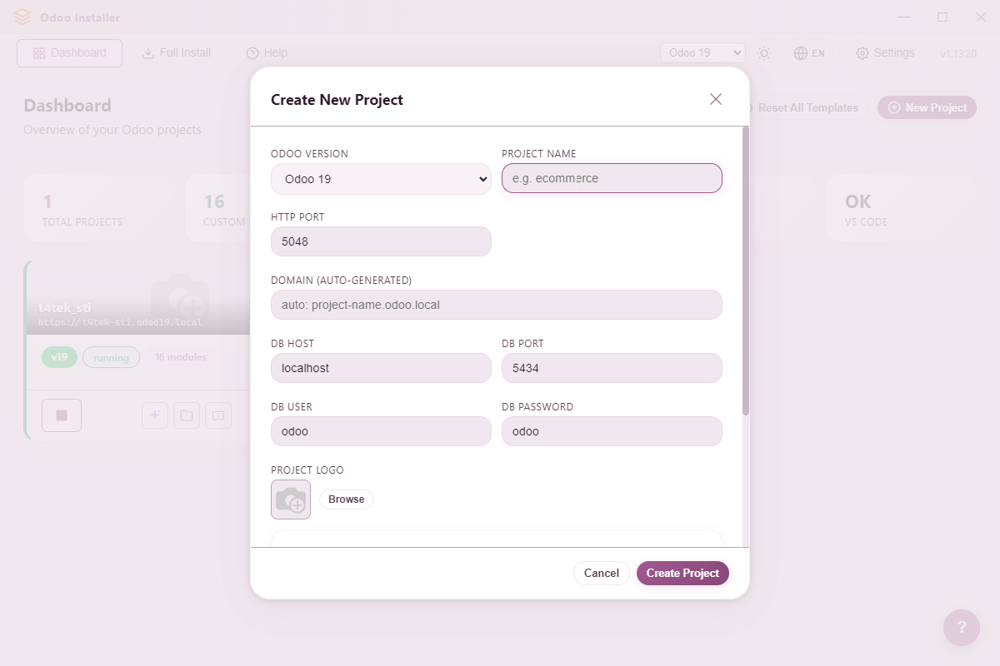
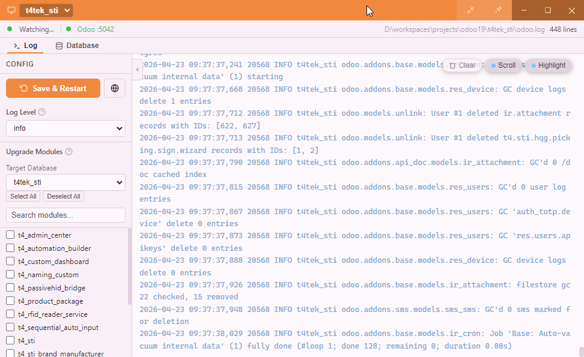
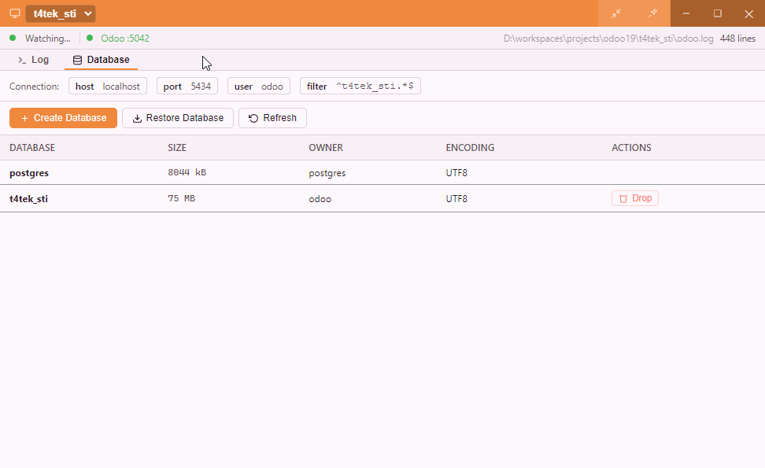
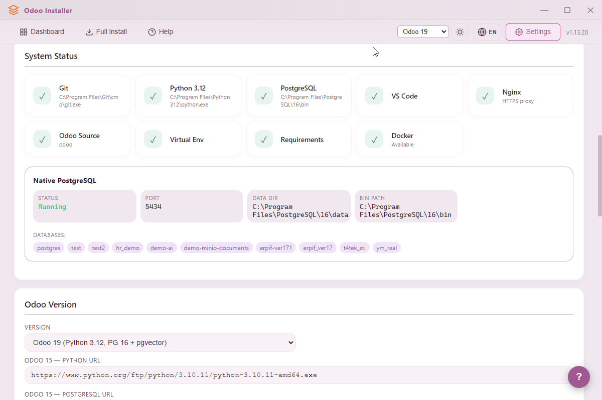
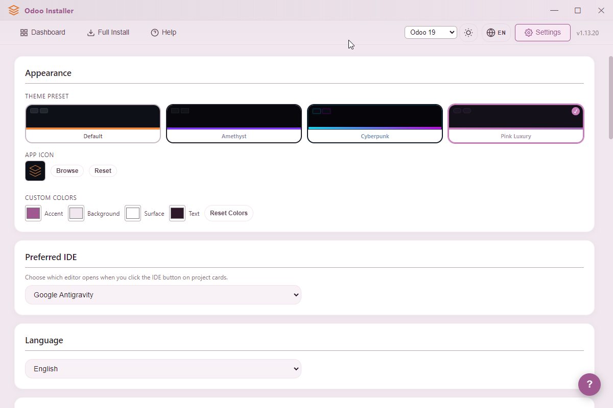
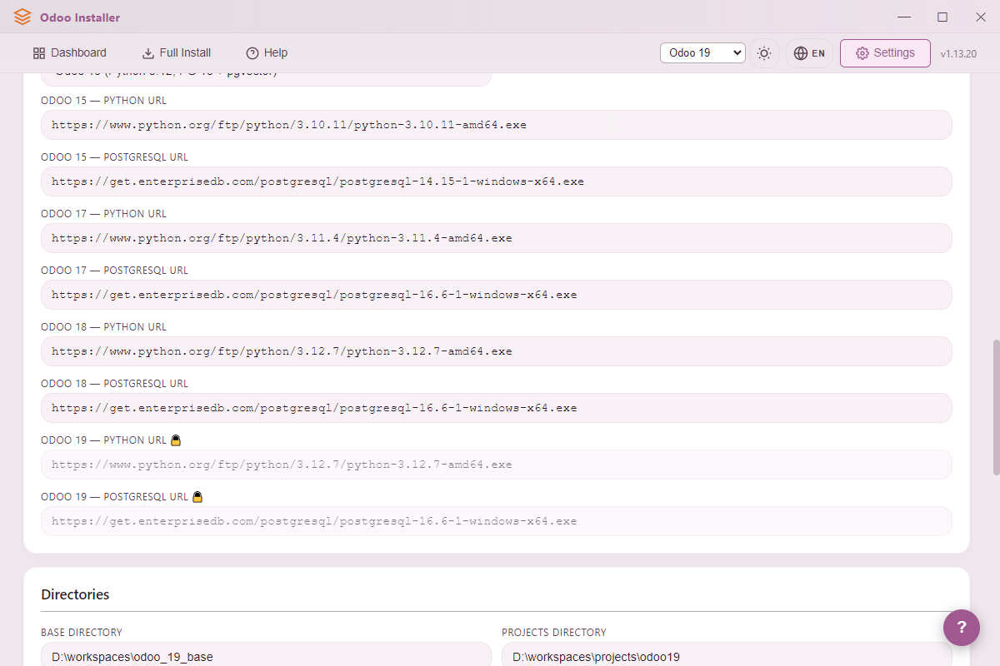
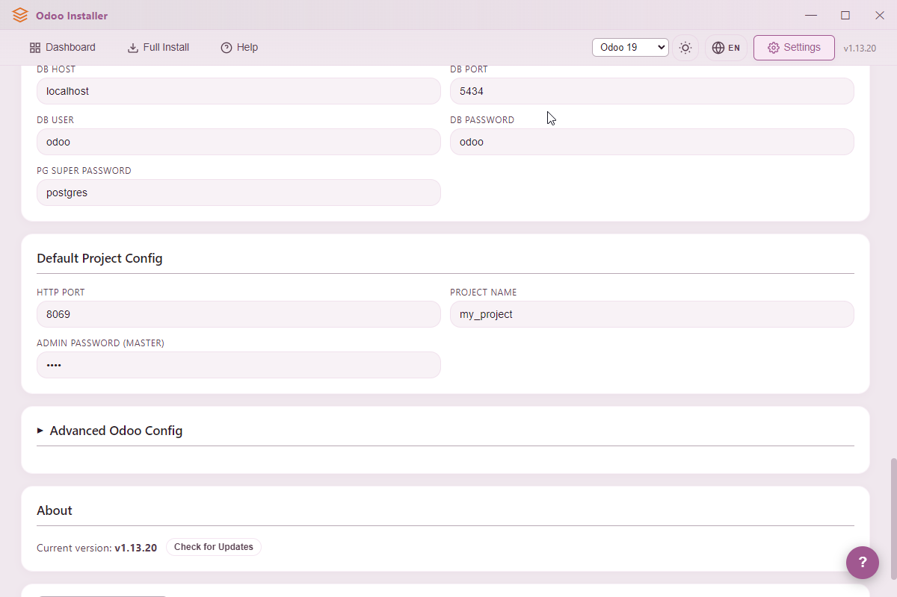

# Odoo Installer

A one‑click Windows desktop app for setting up and managing Odoo **15 / 17 / 18 / 19** development environments. Built with Electron + TypeScript.

> Install Python, PostgreSQL, Git, VS Code, Odoo source, and a ready‑to‑run project in one flow — then manage multiple projects, databases, and logs from a native GUI.


---

## Screenshots

### Dashboard


### Installation wizard


### Create project


### Monitor window — realtime log


### Monitor window — database manager


### Settings & themes









---

## Features

- **One‑click full install** — Nginx, Git, VS Code, Python, PostgreSQL, Odoo source, virtualenv, and pip dependencies.
- **Multi‑version support** — Odoo 15, 17, 18, and 19 with the correct Python / PostgreSQL / branch per version (single source of truth in `src/main/services/odoo-versions.ts`).
- **Shared base + multiple projects** — One Odoo source + venv per version (`odoo_XX_base/`); project folders link to the shared source via junction links.
- **Project manager** — Create, duplicate, delete, start, and stop Odoo projects from the dashboard.
- **Database operations** — List, create, restore (`.dump` / `.sql`), and drop PostgreSQL databases with inline progress rows.
- **Realtime log viewer** — Independent monitor window per project with live tailing (PowerShell tail + poll fallback).
- **Auto‑updates** — Built‑in `electron-updater` pulling from GitHub Releases.
- **i18n** — English, Vietnamese, Korean.
- **Themes** — Dark / light modes, 4 presets (default, autonsi, cyberpunk, luxury), custom accent color.
- **Admin elevation** — Automatically re‑launches elevated when required (junction links, hosts file, services).

---

## Download & Install

1. Go to the [Releases](../../releases) page.
2. Download the latest `Odoo-Installer-Setup-x.y.z.exe`.
3. Run the installer (Windows will prompt for admin rights).
4. Launch **Odoo Installer** from the Start menu or desktop shortcut.

**Auto‑update**: the app checks GitHub on startup and prompts you when a new version is available.

---

## Requirements

- **OS**: Windows 10 / 11 (x64)
- **Admin rights**: required for junction links, hosts file edits, and service installs
- **Disk space**: ~3 GB per Odoo version (source + venv + dependencies)
- **Internet**: required on first run to download the toolchain (Python, PostgreSQL, Git, VS Code) and the Odoo source

Everything else (Python, PostgreSQL, Git, VS Code, Odoo source) is installed automatically by the app.

---

## Quick Start

1. **Launch** the app — the Dashboard opens.
2. Open the **Install** tab and run **Full Install** (or each step individually) for the Odoo version you want.
3. Back on **Dashboard**, click **Create Project** and fill in:
   - Project name — must match `^[a-z_][a-z0-9_\-]*$`
   - Odoo version
   - HTTP port and longpolling port (auto‑validated against existing projects)
   - Database name, admin password
4. Click **Start** on the project card — Odoo launches and a **Monitor** window opens.
5. In the Monitor window:
   - **Log** tab — realtime server log
   - **Database** tab — create / restore / drop databases for this project

---

## Project Layout on Disk

```
D:\workspaces\
├── odoo_15_base\             # One shared base per version
│   ├── odoo\                 # Odoo source
│   └── venv\                 # Python venv
├── odoo_17_base\
├── odoo_18_base\
├── odoo_19_base\
│
└── projects\
    ├── project_a\
    │   ├── odoo  ->  junction to odoo_17_base\odoo
    │   ├── addons\           # Your custom modules
    │   ├── odoo.conf         # addons_path = ./addons,./odoo/addons
    │   └── .vscode\launch.json
    └── project_b\
        └── ...
```

Relative `addons_path` + `cwd = project_dir` on launch means VS Code F5 and **Start** from the app behave identically.

---

## Development

### Prerequisites
- Node.js 18+
- Windows

### Setup
```cmd
cd electron-app
npm install
```

### Run in dev mode
```cmd
npm run dev        :: clean + compile + launch with DevTools
npm start          :: compile + launch without DevTools
npm run watch      :: tsc in watch mode
```

### Build installer locally
```cmd
npm run pack       :: unpacked build in release/
npm run dist       :: full NSIS installer in release/
```

### Publish a new release
```cmd
publish.bat        :: patch bump (default)
publish.bat minor  :: minor bump
publish.bat major  :: major bump — breaking changes only
```

`publish.bat` bumps the version in `package.json`, cleans `release/`, compiles TypeScript, uploads to GitHub Releases via `electron-builder --publish always`, promotes the draft, and pushes the git tag.

Set `GH_TOKEN` in your environment before publishing.

---

## Project Structure

```
electron-app/
├── src/
│   ├── main/                 # Node.js main process
│   │   ├── ipc/              # IPC handlers: window, install, project, db, log, monitor, settings
│   │   ├── services/         # Business logic: installer, projects, detection, odoo-versions, ini-parser, status
│   │   └── utils/            # Shell, download, nginx, hosts, caddy helpers
│   ├── preload/              # Context bridge (IPC channel whitelist)
│   └── renderer/             # Vanilla HTML/CSS/JS UI
│       ├── scripts/          # app, install, dashboard, theme, help, tour, log-viewer, update, i18n
│       ├── styles/           # themes.css, main.css, log-viewer.css
│       ├── locales/          # en.json, vi.json, ko.json
│       └── images/
├── resources/                # App icon and static assets
├── screenshot/               # README screenshots
├── electron-builder.yml      # NSIS packaging + GitHub publish config
├── publish.bat               # One-shot version bump + build + publish
└── package.json
```

### Architecture highlights

- **Three‑process Electron** — main (Node APIs) ↔ preload (context bridge) ↔ renderer (DOM, vanilla JS). No UI framework in the renderer.
- **IPC‑only communication** — no HTTP server. New channels must be whitelisted in `src/preload/index.ts`.
- **Service layer** — IPC handlers parse input and call services; services contain business logic; utils are pure helpers.
- **Version registry** — `odoo-versions.ts` owns every version‑specific constant (Python version, PostgreSQL version, download URL, Git branch).
- **Immutable INI parser** — `iniSet()` returns a new object; `odoo.conf` is never mutated in place.
- **Error codes, not messages** — backend returns codes like `INVALID_NAME`; renderer translates through `_backendMsgMap` and `tMsg()`.
- **Monitor DB jobs** — tracked in `dbJobs` (backend) + `_inlineJobs` (frontend), persisted to `db-jobs.json` in userData to survive restarts.

See `electron-app/CLAUDE.md` and `electron-app/ARCHITECTURE.md` for the full architecture reference.

---

## Adding a Feature

**New IPC channel**
1. Add a handler in the appropriate `src/main/ipc/*-handlers.ts`.
2. Whitelist the channel name in `src/preload/index.ts` (`validChannels`, plus `validPushChannels` for push events).

**New user‑facing text**
1. Add the key to `src/renderer/locales/en.json`.
2. Mirror the key in `vi.json` and `ko.json`.
3. In HTML use `data-i18n="key"`; in JS use `t('key')`.

**New backend error code**
1. Return the code from the service (e.g. `{ ok: false, msg: 'MY_ERROR' }`).
2. Map it in `src/renderer/scripts/app.js` → `_backendMsgMap`.
3. Add `toast.myError` (or similar) to all three locale files.

---

## Troubleshooting

- **App won’t start / permission errors** — Run as Administrator. Packaged builds auto‑elevate; the dev build does not.
- **Port already in use** — Change `http_port` / `longpolling_port` in the project’s `odoo.conf`, or stop the other project first.
- **PostgreSQL connection fails** — Check PostgreSQL is running (Services → `postgresql-x64-XX`) and the password in project settings matches. `PGPASSWORD` is passed through env to avoid interactive prompts.
- **Install step stuck** — Open the log panel on the Install page. Most failures are network‑related and succeed on retry.
- **Auto‑update not working** — Inspect `updater.log` in the app’s userData folder (`%APPDATA%/odoo-installer/`).

---

## License

MIT
