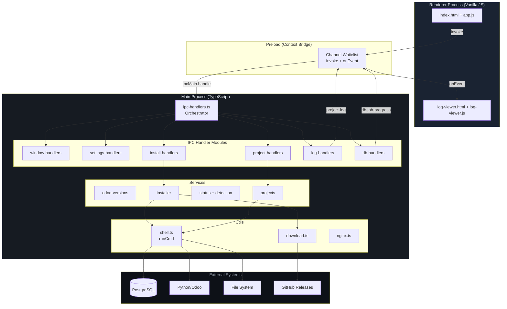
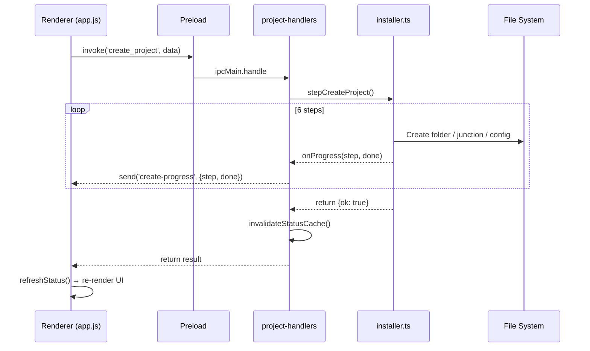
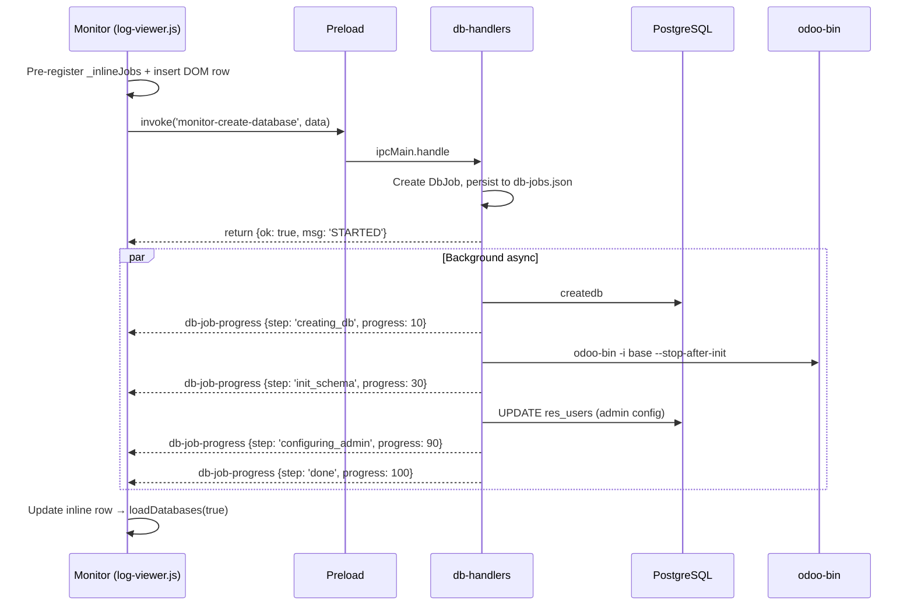

# Architecture Overview

Tài liệu kiến trúc cho **Odoo Installer** — ứng dụng desktop Electron cài đặt và quản lý Odoo trên Windows.

## Tech Stack

| Layer | Công nghệ | Ghi chú |
|-------|-----------|---------|
| **Desktop Runtime** | Electron 33 | Frameless window, system tray, admin elevation |
| **Main Process** | TypeScript (ES2022, CommonJS) | Node.js APIs, IPC handlers, shell commands |
| **Renderer** | Vanilla HTML/CSS/JS | Không framework, không bundler, `<script>` tags |
| **Preload** | TypeScript | Context bridge + channel whitelist |
| **Build** | `tsc` (TypeScript compiler) | Không webpack/vite — chỉ compile TS → JS |
| **Package** | electron-builder | NSIS installer, GitHub Releases auto-update |
| **i18n** | Custom zero-dependency | 3 ngôn ngữ: EN, VI, KO |
| **Styling** | CSS custom properties | 4 theme presets × dark/light = 8 themes |

## Folder Structure

```
electron-app/
├── src/
│   ├── main/                    # Main Process (TypeScript)
│   │   ├── index.ts             # Entry: BrowserWindow, Tray, admin elevation
│   │   ├── ipc-handlers.ts      # Orchestrator → gọi các module trong ipc/
│   │   ├── ipc/                 # IPC handler modules (tách theo domain)
│   │   │   ├── context.ts       # IpcContext type (shared state)
│   │   │   ├── window-handlers  # Window controls, file dialogs
│   │   │   ├── settings-handlers# Settings, versions, icons
│   │   │   ├── install-handlers # Status detection, install steps
│   │   │   ├── project-handlers # Project CRUD, start/stop Odoo
│   │   │   ├── log-handlers     # Log watching, monitor windows
│   │   │   ├── db-handlers      # Database CRUD, job persistence
│   │   │   ├── monitor-handlers # Orchestrator: log + db
│   │   │   └── telemetry-handlers # Admin auth, action tracking, admin window
│   │   ├── services/            # Business logic
│   │   │   ├── odoo-versions.ts # Version registry (single source of truth)
│   │   │   ├── installer.ts     # 8 install steps
│   │   │   ├── projects.ts      # delete, duplicate, read/save config
│   │   │   ├── status.ts        # Detect system + parse projects
│   │   │   ├── detection.ts     # Find Python, PG, VS Code, Docker
│   │   │   ├── config.ts        # Default paths, URLs
│   │   │   ├── ini-parser.ts    # Immutable INI read/write
│   │   │   ├── logger.ts        # In-memory log buffer
│   │   │   ├── updater.ts       # Auto-update via GitHub Releases
│   │   │   ├── step-lock.ts     # Prevent concurrent steps
│   │   │   └── telemetry.ts     # Action logs, offline buffer, admin stats, auth
│   │   └── utils/               # Pure helpers
│   │       ├── shell.ts         # runCmd, runCmdStreaming
│   │       ├── download.ts      # HTTP download + progress
│   │       ├── nginx.ts         # Nginx install/config
│   │       ├── hosts.ts         # Windows hosts file
│   │       └── caddy.ts         # Caddy reverse proxy
│   ├── preload/
│   │   └── index.ts             # Context bridge + channel whitelist
│   └── renderer/                # Renderer Process (Vanilla JS)
│       ├── index.html           # Main SPA
│       ├── log-viewer.html      # Monitor window (HTML only)
│       ├── admin-dashboard.html # Admin dashboard window (HTML only)
│       ├── scripts/
│       │   ├── i18n.js          # Internationalization engine
│       │   ├── app.js           # Core: nav, API, forms, projects
│       │   ├── install.js       # Install step cards UI
│       │   ├── dashboard.js     # Kanban, stats, project detail
│       │   ├── update.js        # Auto-update UI
│       │   ├── theme.js         # Theme presets, dark/light toggle
│       │   ├── help.js          # Docs, troubleshooting
│       │   ├── tour.js          # Guided tour overlay
│       │   ├── docs-data.js     # Help content data
│       │   ├── log-viewer.js    # Monitor window logic
│       │   ├── admin.js         # Admin password prompt + open admin window
│       │   ├── admin-dashboard.js # Admin dashboard logic (stats, logs, users, charts)
│       │   └── lib/
│       │       └── chart.min.js # Chart.js (only third-party script in renderer)
│       ├── styles/
│       │   ├── themes.css       # 4 presets × 2 modes + transitions
│       │   ├── main.css         # Layout + components
│       │   ├── log-viewer.css   # Monitor window styles
│       │   ├── admin.css        # Admin password modal
│       │   ├── admin-dashboard.css # Admin dashboard window
│       │   ├── docs.css         # Help panel
│       │   └── tour.css         # Tour overlay
│       └── locales/
│           ├── en.json          # English
│           ├── vi.json          # Vietnamese
│           └── ko.json          # Korean
├── templates/                   # Odoo project templates
│   ├── odoo.conf                # {key} placeholders
│   ├── launch.json              # VS Code debug config
│   └── settings.json            # VS Code workspace settings
├── resources/                   # App icons
├── publish.bat                  # Windows publish script
├── electron-builder.yml         # Packaging config
├── tsconfig.json                # TypeScript config
└── package.json                 # Dependencies + scripts
```

## Core Modules & Responsibilities

### Version Registry (`odoo-versions.ts`)
Single source of truth cho tất cả config phụ thuộc version Odoo:

```
OdooVersionKey: '15' | '17' | '18' | '19'
Mỗi version → Python URL, PG URL, branch, Docker image, base dir, color
```

Toàn bộ hệ thống tra cứu version qua `getVersionConfig(key)`. Không hardcode version-specific values ở nơi khác.

### IPC Context Pattern
Tất cả IPC handlers nhận chung 1 `IpcContext` object chứa shared state:

```typescript
interface IpcContext {
  mainWindow: BrowserWindow;   // Main app window
  logger: LoggerService;       // In-memory log buffer
  stepLock: StepLockManager;   // Prevent concurrent installs
  logWatchers: Map<string, LogWatcherEntry>;  // Active file watchers
  logWindows: Map<string, BrowserWindow>;     // Open monitor windows
}
```

### DB Job Persistence
Database operations (create/restore/drop) chạy async với job tracking:

```
Frontend (_inlineJobs Map) ←→ Backend (dbJobs Map) ←→ Disk (db-jobs.json)
```

- Jobs persist qua app restart (file `db-jobs.json` trong `userData`)
- Jobs đang `running` khi app restart → chuyển thành `interrupted`
- Frontend pre-register job TRƯỚC khi gọi API (tránh race condition với IPC events)

## Data Flow



## Data Flow Chi Tiết: Tạo Project



## Data Flow Chi Tiết: Database Operation (Create DB)



## API/Interface Design

### IPC Channels (Request-Response)

| Domain | Channels |
|--------|----------|
| **Window** | `window-minimize`, `window-maximize`, `window-close`, `window-is-maximized`, `pick-folder`, `pick-file`, `open_vscode`, `open_browser`, `open_explorer` |
| **Settings** | `app-version`, `default-paths`, `odoo-versions`, `load-settings`, `save-settings`, `get-icon`, `pick-icon`, `reset-icon` |
| **Install** | `status`, `log`, `full_install`, `run_step` |
| **Project** | `create_project`, `read_config`, `save_config`, `delete_project`, `duplicate_project`, `reset_templates`, `start_odoo`, `stop_odoo` |
| **Monitor** | `watch-log`, `unwatch-log`, `open-log-window`, `broadcast-theme`, `log-window-pin`, `log-window-minimize`, `log-window-maximize` |
| **Log Viewer** | `log-viewer-server-status`, `log-viewer-projects`, `log-viewer-info`, `log-viewer-restart` |
| **Database** | `monitor-list-databases`, `monitor-create-database`, `monitor-drop-database`, `monitor-restore-database`, `monitor-db-job-status`, `monitor-dismiss-db-job` |
| **Telemetry / Admin** | `admin-verify-password`, `fetch-admin-stats`, `fetch-admin-logs`, `fetch-admin-users`, `open-admin-window`, `track-action` |

### Push Events (Main → Renderer)

| Event | Source | Data |
|-------|--------|------|
| `log-message` | logger | Dòng log mới |
| `task-progress` | full_install | {status, step, progress} |
| `download-progress` | download.ts | {step, percent, MB} |
| `project-log` | log-handlers | {logPath, lines[]} |
| `create-progress` | project-handlers | {step, done} |
| `delete-progress` | project-handlers | {step, done} |
| `duplicate-progress` | project-handlers | {step, done} |
| `db-job-progress` | db-handlers | {type, dbName, step, status, progress, elapsed} |
| `update-status` | updater | {status, version, percent} |
| `language-changed` | settings-handlers | {language} |
| `theme-changed` | settings-handlers | {preset, mode, custom} |

### Backend Error Code Convention

```
Backend: return { ok: false, msg: 'INVALID_NAME' }
Frontend: _backendMsgMap['INVALID_NAME'] → 'toast.invalidName' → t('toast.invalidName')
```

Không bao giờ return human-readable message từ backend. Luôn return error CODE.

## Key Patterns & Conventions

### Immutable INI Parser
```typescript
// ĐÚNG — trả về object mới
ini = iniSet(ini, 'options', 'http_port', '8069');

// SAI — mutation
ini.options.http_port = '8069';
```

### Renderer Script Loading (Global Scope)
Tất cả renderer scripts share global scope qua `<script>` tags. Thứ tự load quan trọng:

**`index.html`** (main window):
```html
<script src="scripts/i18n.js"></script>       <!-- 1. i18n engine (t() function) -->
<script src="scripts/docs-data.js"></script>  <!-- 2. Help content data -->
<script src="scripts/tour.js"></script>       <!-- 3. Tour component -->
<script src="scripts/app.js"></script>        <!-- 4. Core: defines api(), $(), shared state -->
<script src="scripts/install.js"></script>    <!-- 5. Depends on app.js globals -->
<script src="scripts/dashboard.js"></script>  <!-- 6. Depends on app.js globals -->
<script src="scripts/update.js"></script>     <!-- 7. Depends on api() -->
<script src="scripts/theme.js"></script>      <!-- 8. Depends on $(), api() -->
<script src="scripts/help.js"></script>       <!-- 9. Depends on t(), tour -->
<script src="scripts/admin.js"></script>      <!-- 10. Admin password + open admin window -->
```

**`admin-dashboard.html`** (admin window — separate BrowserWindow):
```html
<script src="scripts/lib/chart.min.js"></script>   <!-- 1. Chart.js (bundled third-party) -->
<script src="scripts/admin-dashboard.js"></script> <!-- 2. Stats / logs / users / charts -->
```

**`log-viewer.html`** (per-project monitor window — separate BrowserWindow):
- Loads `scripts/log-viewer.js` + `styles/log-viewer.css` independently. Syncs theme from main app via `theme-changed` IPC event.

### Theme System
```
<html data-preset="cyberpunk" data-mode="light">
  → CSS tự switch qua selectors: [data-preset="cyberpunk"][data-mode="light"]
  → Monitor windows nhận theme qua IPC 'theme-changed' event
  → Mỗi monitor có unique accent color (10 colors rotate)
```

### DB Job Race Condition Prevention
```javascript
// Frontend: pre-register TRƯỚC khi gọi API
_inlineJobs.set('create', { ... });
insertDomRow();
const res = await invoke('monitor-create-database', ...);
// Nếu API fail → rollback: xóa row, mở lại modal

// Lý do: backend emit db-job-progress event TRƯỚC khi invoke response trả về renderer
```

### Log File Watching
Dual strategy cho reliability trên Windows:
1. **Primary**: PowerShell `Get-Content -Wait -Tail 0` (like `tail -f`)
2. **Fallback**: Stat-based polling mỗi 300ms (nếu PowerShell fail)
3. **Multi-subscriber**: Nhiều monitor windows có thể watch cùng 1 file

### Path Safety
```typescript
// Luôn validate project name
if (!isValidName(name)) return { ok: false, msg: 'INVALID_NAME' };
// Luôn check path traversal
if (!path.resolve(target).startsWith(path.resolve(parent) + path.sep)) { ... }
```

## External Dependencies & Why

### Runtime Dependencies

| Package | Version | Lý do |
|---------|---------|-------|
| `electron-updater` | ^6.8.3 | Auto-update từ GitHub Releases. Electron built-in autoUpdater không hỗ trợ GitHub provider. |
| `ini` | ^5.0.0 | Parse/serialize INI files (odoo.conf). Custom `ini-parser.ts` wrap thêm immutable pattern. |

### Dev Dependencies

| Package | Version | Lý do |
|---------|---------|-------|
| `electron` | ^33.0.0 | Desktop runtime. v33 cho Chromium 130 + Node.js 20. |
| `electron-builder` | ^25.0.0 | Package thành NSIS installer (.exe) + GitHub Releases publishing. |
| `typescript` | ^5.5.0 | Type safety cho main process. Renderer dùng vanilla JS (không compile). |
| `rimraf` | ^6.0.0 | Cross-platform `rm -rf` cho clean scripts. |
| `@types/node` | ^20.14.0 | TypeScript definitions cho Node.js APIs. |

### Tại sao ít dependencies?
Design principle: **zero external dependencies cho renderer**. Không React, không Vue, không webpack. Installer's venv tách biệt hoàn toàn với Odoo venv. Giữ stack đơn giản để:
- Build nhanh (chỉ `tsc`, không bundler)
- Package nhỏ (asar ~5MB thay vì 50MB+ với framework)
- Không version conflict với Odoo's Python dependencies
